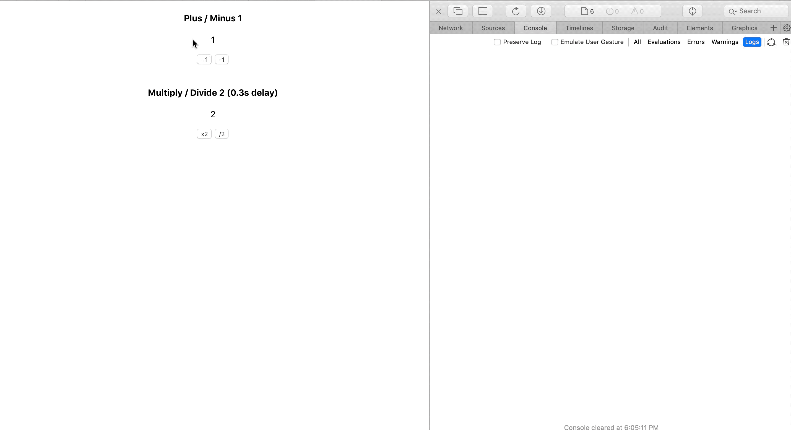

# mini-redux
A small redux for study.

# Demo
View the demo from here https://daiyanze.com/mini-redux/build/index.html

# Article
Here is the article introducing creating mini redux for learning FP design.

[FP Practice: Create my mini Redux](https://pitayan.com/posts/redux-fp-design/?ref=github)
